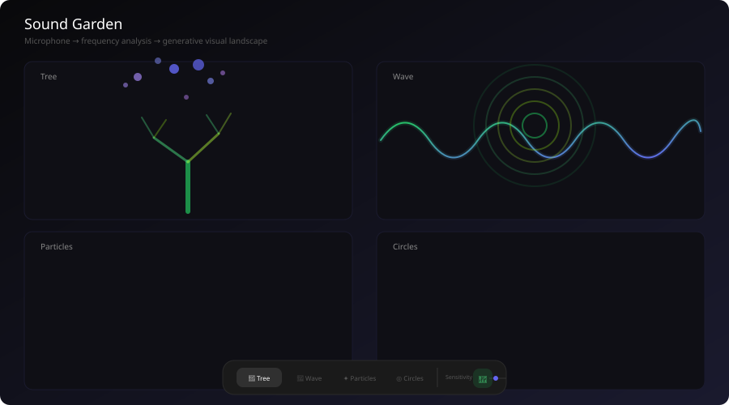

<p align="center">
  
</p>

<h1 align="center">Sound Garden</h1>

<p align="center">
  <strong>Your voice grows a tree.</strong><br/>
  Real-time microphone → frequency analysis → generative visual landscape.<br/>
  No AI. No network. Just physics.
</p>

<p align="center">
  <a href="https://lov-alt.github.io/sound-garden/"></a>
  <a href="https://github.com/lov-alt/sound-garden/stargazers"></a>
  <a href="LICENSE"></a>
</p>

---

## What It Does

Sound Garden transforms your microphone input into a living, breathing visual landscape — in real-time, at 60 frames per second. It's equal parts audio tool, meditation aid, and generative art experiment.

## Visual Modes

| Mode | What you see | Sound mapping |
|---|---|---|
| **Tree** | Full tree with foliage clusters, grass, roots, and falling particles. 6 levels of branching with green/pink leaf crowns. | Bass → trunk + roots · Mid → branches + leaf density · Treble → leaf hue shift · Volume → particle count |
| **Wave** | A glowing oscilloscope. The raw waveform ripples across the screen. The most literal representation of sound. | Waveform amplitude → vertical displacement |
| **Particles** | Particles orbit a center. Loud = many large particles. Quiet = few small ones. They rotate faster with mid-range energy. | Bass → orbit radius · Volume → count + size · Mid → rotation speed |
| **Circles** | Five concentric rings, one per frequency band. The outer ring pulses with bass. The inner ring trembles with treble. | Each band → one ring's radius + opacity |

## How It Works

```
navigator.mediaDevices.getUserMedia()
            ↓
      AudioContext.createAnalyser()
            ↓
    analyser.fftSize = 1024
    analyser.smoothingTimeConstant = 0.7
            ↓
  analyser.getByteFrequencyData(freqData)   ←─ 60 times/second via requestAnimationFrame
  analyser.getFloatTimeDomainData(waveData)
            ↓
 5-band frequency decomposition            ←─ bass / lowMid / mid / highMid / treble
            ↓
  Canvas 2D renderer                       ←─ tree / wave / particles / circles
```

## Controls

The floating toolbar at the bottom lets you switch modes and tweak sensitivity without covering the canvas.

- **Mode buttons** — Switch between Tree, Wave, Particles, and Circles
- **Sensitivity slider** — 0.5× to 3×. Turn it up for quiet environments, down for loud ones
- **Volume meter** — Real-time bar showing current input level
- **Mic toggle** — Start or stop the microphone stream

## Project Structure

```text
sound-garden/
├── src/
│   ├── engine/
│   │   ├── audio.ts            # Web Audio API engine — AudioContext + AnalyserNode wrapper
│   │   └── renderer.ts         # Canvas 2D renderers — 4 visual modes, 0 if statements
│   ├── hooks/
│   │   └── useAudioLoop.ts     # React hook — requestAnimationFrame loop + state management
│   ├── App.tsx                  # Full-screen canvas + floating toolbar
│   ├── main.tsx
│   └── index.css               # Tailwind + custom slider styling
├── docs/preview.svg            # Preview image showing all 4 modes
└── .github/workflows/
```

Sound Garden is a standalone creative tool, part of a five-tool open-source suite:

| Tool | What it does |
|---|---|
| **[Design Token Studio](https://github.com/lov-alt/design-token-studio)** | Define design tokens — colors, typography, spacing — with WCAG checker |
| **[CSS Visual Toolbox](https://github.com/lov-alt/css-visual-toolbox)** | Visually edit CSS properties (clip-path, gradients, shadows, border-radius) |
| **[Typography Lab](https://github.com/lov-alt/typography-lab)** | Content-driven layout generator — 14 archetypes, 8 typographic traditions |
| **[Motion Token Studio](https://github.com/lov-alt/motion-token-studio)** | Design motion tokens — cubic-bezier editor, duration scale, 12 presets |
| **Sound Garden** ← you are here | Real-time microphone → generative visual landscape |

| Layer | Technology |
|---|---|
| **Audio capture** | Web Audio API — `AudioContext` + `AnalyserNode` · FFT 1024 · 5-band decomposition |
| **Rendering** | Canvas 2D — `requestAnimationFrame` @ 60fps · `ResizeObserver` · `devicePixelRatio` aware |
| **UI** | React 19 · TypeScript · Tailwind CSS v4 · Zero runtime dependencies |

## Frequency Band Mapping

| Band | Range | What's in it | Controls |
|---|---|---|---|
| **Bass** | 20–140 Hz | Kick drums, bass guitar, low hum | Tree trunk + roots + grass · Particle orbit radius · Circle outer ring |
| **Low Mid** | 140–400 Hz | Lower vocals, toms, guitar body | Branch count · Circle ring 2 |
| **Mid** | 400–1200 Hz | Core vocals, snare, piano | Branch complexity · Particle rotation speed · Circle ring 3 |
| **High Mid** | 1.2–4 kHz | Clarity, consonants, cymbals | Tree hue shift · Circle ring 4 |
| **Treble** | 4–16 kHz | Air, shimmer, hi-hats | Tree color temperature · Circle inner ring |

## Quick Start

```bash
git clone https://github.com/lov-alt/sound-garden.git
cd sound-garden
npm install
npm run dev          # http://localhost:5173
```

Requires a browser with `getUserMedia` support (Chrome, Firefox, Edge, Safari). HTTPS required for microphone access in production.

## License

[MIT](./LICENSE) © 2026 lov-alt — Use freely, modify freely, distribute freely. Software provided "as is", without warranty of any kind.
